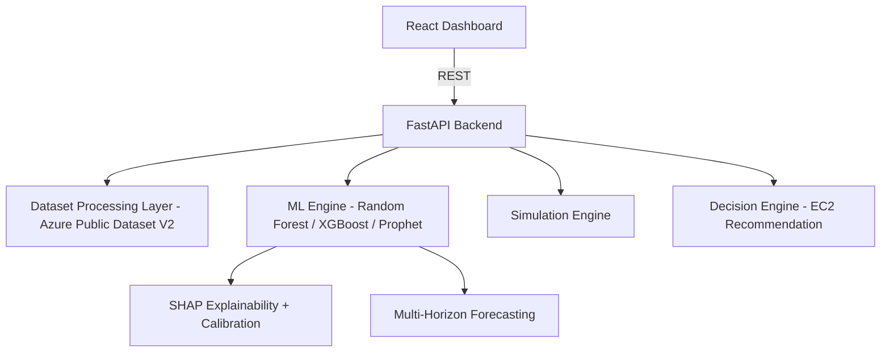

<div align="center">

# CloudPulse

### Cloud Resource Utilization Forecasting & Optimization Platform

A research-grade cloud intelligence system that predicts infrastructure utilization states, forecasts CPU load across multiple horizons, explains its predictions, and simulates scaling decisions, trained on real production traces.

**[Live Demo (Frontend)](YOUR_VERCEL_URL_HERE)** · **[API (Backend)](YOUR_RENDER_URL_HERE)**

</div>

---

## Table of Contents

- [Overview](#overview)
- [Results](#results)
- [Key Features](#key-features)
- [Methodology](#methodology)
- [System Architecture](#system-architecture)
- [Tech Stack](#tech-stack)
- [Project Structure](#project-structure)
- [Getting Started](#getting-started)
- [Deployment](#deployment)
- [Limitations](#limitations)
- [References](#references)
- [Author](#author)

---

## Overview

CloudPulse is a cloud observability and optimization platform that analyzes resource utilization, predicts future utilization states, and recommends cost-efficient infrastructure decisions by combining machine learning with rule-based logic.

The models are trained on the **Azure Public Dataset V2** (CPU utilization traces) rather than synthetic data. The training pipeline is designed to prevent label leakage: features are computed strictly from past observation windows and used to predict future status, and evaluation uses group-aware splits so that no entity appears in both training and test sets.

---

## Results

Production model (Random Forest, 5-minute horizon), evaluated on a held-out, whole-VM-disjoint test set:

| Model | Task | Metric | Score |
| :--- | :--- | :--- | :--- |
| Random Forest | Utilization state classification | Accuracy | 0.9795 |
| Random Forest | Utilization state classification | Macro F1 | 0.8743 |
| XGBoost | Utilization state classification | Macro F1 | 0.8065 |
| Prophet | CPU utilization forecasting | RMSE | 0.0589 |
| Majority-class baseline | Utilization state classification | Accuracy | 0.9364 |
| Confidence calibration | Prediction reliability | ECE | 0.0111 |

**Multi-horizon Random Forest performance:**

| Horizon | Accuracy | Macro F1 | Calibration ECE |
| :--- | :--- | :--- | :--- |
| 5 min | 0.9795 | 0.8743 | 0.0111 |
| 15 min | 0.9785 | 0.8588 | 0.0127 |
| 30 min | 0.9762 | 0.8442 | 0.0091 |

Random Forest artifacts were retrained with constrained depth and leaf count for deployment efficiency — a ~90% reduction in model size for a documented 1–2 point macro F1 cost. Every metric above reflects the final, deployed model, not an earlier uncompressed version.

---

## Key Features

### Utilization State Prediction

- Classifies resource state as **Underutilized**, **Normal**, or **Overutilized**
- Multi-model training and comparison: Random Forest, XGBoost, and Prophet
- Features derived exclusively from past-window telemetry

### Multi-Horizon Forecasting

- Forecasts at **5, 15, and 30-minute** horizons
- Forecast timeline integrated into the live dashboard

### Prediction Confidence & Explainability

- Calibrated prediction confidence, evaluated with Expected Calibration Error
- Per-prediction **SHAP** explanations using TreeExplainer
- Documented finding of overconfidence on the Underutilized class

### Simulation Engine

- What-if scenario analysis for CPU scaling
- Live recalculation of predicted state via the real backend model, not a client-side approximation
- Dedicated simulation panel in the dashboard

### EC2 Recommendation System

- Workload-based instance mapping logic
- Cost-aware optimization
- Waste detection and efficiency scoring

### Model Documentation

- Model Card following the format proposed by Mitchell et al. (2019)

---

## Methodology

**Label leakage correction.** An early version of the pipeline reported perfect accuracy because features were computed from the same timestamp as the label. The pipeline was rebuilt so that features come only from strictly past windows and the label is the future status. Evaluation uses `GroupShuffleSplit` to keep related records within a single split. The corrected results above reflect this stricter protocol.

**Dataset scoping.** The Azure Public Dataset V2 contains CPU utilization only. Memory telemetry is absent, so the original CPU-plus-memory formulation and the memory-intensive category were removed rather than approximated with synthetic values.

**Deployment-size optimization.** Initial Random Forest artifacts exceeded 250MB each at default training parameters — impractical for version control or deployment. Models were retrained with constrained `max_depth` and `max_leaf_nodes`, cutting size by ~90% for a documented, bounded accuracy cost. Metrics, calibration reports, and SHAP outputs were regenerated against the final deployed models.

---

## System Architecture



---

## Tech Stack

| Layer | Technology |
| :--- | :--- |
| Frontend | React, Vite, Tailwind CSS, Recharts |
| Backend | Python, FastAPI |
| Machine Learning | Scikit-learn, XGBoost, Prophet, SHAP, Pandas, NumPy, Joblib |
| Data | Azure Public Dataset V2 |
| Hosting | Vercel (frontend) · Render (backend) |

---

## Project Structure

```text
CloudPulse/
├── backend/         # FastAPI services, ML pipeline, decision engine
├── frontend/        # React dashboard
├── vercel.json
└── README.md
```

---

## Getting Started

### Prerequisites

- Python 3.11+
- Node.js 18+
- Azure Public Dataset V2 CPU traces, obtained from the official source

### Backend

```bash
cd backend
python -m venv .venv
source .venv/bin/activate      # Windows: .venv\Scripts\activate
pip install -r requirements.txt
uvicorn app:app --reload
```

### Frontend

```bash
cd frontend
npm install
npm run dev
```

---

## Deployment

- **Frontend** — deployed on Vercel: `YOUR_VERCEL_URL_HERE`
- **Backend** — deployed on Render: `YOUR_RENDER_URL_HERE`

---

## Limitations

- The source dataset provides CPU utilization only; memory-based analysis is out of scope.
- The classifier shows overconfidence on the Underutilized class, documented in the Model Card.
- EC2 recommendations are rule-based mappings and do not account for provider pricing changes.
- Model artifacts were size-constrained for deployment; this trades a small, documented amount of accuracy and calibration precision for a ~90% reduction in model file size.

---

## References

- Cortez et al., "Resource Central: Understanding and Predicting Workloads for Improved Resource Management in Large Cloud Platforms," SOSP 2017 (Azure Public Dataset).
- Mitchell et al., "Model Cards for Model Reporting," 2019.

---

## Author

**Chella Krishnan D**
[GitHub](https://github.com/iamkr07) · [LinkedIn](https://linkedin.com/in/chella-krishnan-d-a91172383)
